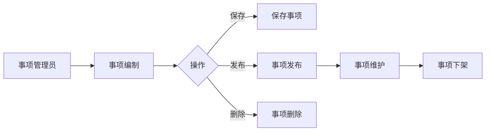
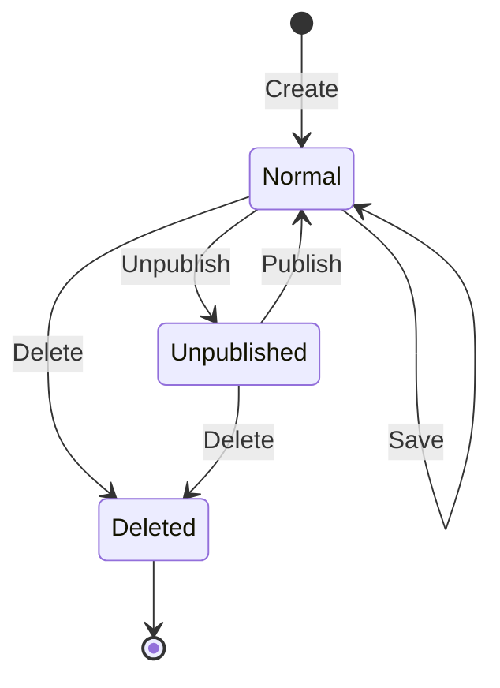

# 政务服务事项管理系统需求分析文档

> 基于 BladeX 4.8.0 + Spring Boot 3 + Vue 3 的整体需求分析

---

## 第 1 章 项目概述

### 1.1 功能背景与目标

本模块为**政务服务事项管理系统**，旨在实现对政务服务事项的统一管理和维护，覆盖市、区两级政务服务中心的事项全生命周期管理，提升政务服务标准化、规范化、便利化水平。

**核心目标**：
- 实现政务服务事项的统一录入、管理和维护
- 支持事项信息的动态更新
- 提供便捷的事项查询和统计功能
- 确保事项信息的准确性和时效性

### 1.2 系统架构说明

| 端 | 技术栈 | 说明 |
|---|--------|------|
| PC 前端 | Vue 3 + Vite + Element Plus + Avue 3.7 | 事项管理、发布、统计 |
| 后端 | Spring Boot 3.2.10 + BladeX 4.8.0 + MyBatis-Plus | 统一 API 服务 |
| 数据库 | MySQL 8.0 + Redis | 业务数据缓存 |
| 认证授权 | OAuth2 + JWT | BladeX 统一认证 |

### 1.3 整体业务流程图



> **实现范围说明**：
> - **一期实现**：事项信息管理（CRUD）、事项发布/下架
> - **暂不实现**：事项版本对比、事项办件统计、网上申报对接、审核流程

---

## 第 2 章 角色与权限设计

### 2.1 角色列表

| 角色 | 说明 | 对应 BladeX 角色 |
|------|------|-----------------|
| 事项管理员 | 负责事项的编制、录入、维护、发布/下架 | `affair_admin` |
| 系统管理员 | 管理基础配置、用户、角色 | `administrator` |
| 普通用户 | 查看已发布事项（预留） | `viewer` |

**注**：根据 2-A 确认，本系统简化版不实现审核流程，审核人员角色已移除。

### 2.2 功能权限矩阵

| 功能模块 | 事项管理员 | 系统管理员 | 普通用户 |
|---------|-----------|-----------|---------|
| 事项新增 | 新建/编辑 | 所有 | - |
| 事项编辑 | 编辑（本机构） | 所有 | - |
| 事项删除 | 删除（本机构） | 所有 | - |
| 事项查询 | 查看（本机构） | 所有 | 查看已发布 |
| 事项发布 | 发布/下架 | 所有 | - |
| 字典管理 | - | 所有 | - |

**权限规则**：
- 仅创建人可维护本人创建的事项
- 系统管理员拥有所有权限
- 菜单权限：通过 `blade_menu` 表配置，前端 `@PreAuth` 注解控制

### 2.3 菜单与按钮权限设计

| 菜单名称 | 菜单编号 (code) | 按钮名称 | 按钮编号 (alias) | 权限码 |
|---------|----------------|---------|-----------------|--------|
| 政务服务事项管理 | `affair` | - | - | `affair` |
| └─ 事项信息管理 | `affair_manage` | 新增 | add | `affair_manage_add` |
| | | 修改 | edit | `affair_manage_edit` |
| | | 删除 | delete | `affair_manage_delete` |
| | | 查看 | view | `affair_manage_view` |
| | | 发布 | publish | `affair_manage_publish` |
| | | 下架 | unpublish | `affair_manage_unpublish` |

**注**：根据 2-A 确认，本系统简化版不实现审核管理菜单，相关按钮已移除。

> **BladeX 规范**：
> - 菜单编号 (`code`) 与 Controller 的 `@PreAuth(menu = "xxx")` 对应
> - 按钮权限码前端通过 `permission.xxx` 控制显示/隐藏

---

## 第 3 章 功能模块详细说明

### 3.1 事项信息管理

- **访问端**：PC 端
- **功能描述**：政务服务事项的增删改查、发布/下架

#### 页面列表

- 事项列表页 (`/views/affair/manage/index.vue`)
- 事项新增/编辑页 (`/views/affair/manage/form.vue`)
- 事项详情页 (`/views/affair/manage/detail.vue`)

#### 字段说明

| 字段名 | 字段类型 | 是否必填 | 说明 | 后端字段 |
|--------|---------|---------|------|---------|
| 事项名称 | 文本输入 | 是 | 事项标准名称，最多 200 字 | `affair_name` |
| 事项简称 | 文本输入 | 否 | 事项简称，最多 100 字 | `affair_short_name` |
| 实施编码 | 只读 | - | 系统自动生成的唯一编码 | `implement_code` |
| 事项类别 | 下拉选择 | 是 | 数据来源：`affair_type` 字典 | `affair_type` |
| 法定时限 | 数字输入 | 是 | 单位：工作日，0 表示即时办结 | `legal_limit` |
| 承诺时限 | 数字输入 | 是 | 单位：工作日，≤法定时限 | `promise_limit` |
| 办理条件 | 富文本编辑 | 是 | 支持 HTML 格式 | `handle_condition` |
| 所需材料 | 动态列表 | 否 | 材料清单（子表），可选 | - |
| 备注说明 | 文本域 | 否 | 其他说明信息 | `remark` |
| 事项状态 | 只读 | - | 正常/下架/删除 | `status` |

**所需材料子表字段**：

| 字段名 | 字段类型 | 是否必填 | 说明 | 后端字段 |
|--------|---------|---------|------|---------|
| 材料名称 | 文本输入 | 是 | 材料标准名称 | `material_name` |
| 材料类型 | 下拉选择 | 是 | 原件/复印件/电子文件 | `material_type` |
| 份数要求 | 数字输入 | 是 | 默认 1 份 | `material_copies` |
| 是否必收 | 单选框组 | 是 | 是/否 | `is_required` |
| 材料说明 | 文本输入 | 否 | 材料具体要求 | `material_remark` |

#### 操作按钮

| 按钮名 | 触发条件 | 操作说明 | 接口 |
|--------|---------|---------|------|
| 新增 | 列表页点击 | 打开新增表单 | GET /create |
| 保存 | 必填项校验通过 | 保存事项 | POST /save |
| 编辑 | 勾选可编辑记录 | 打开编辑表单 | GET /detail |
| 删除 | 勾选记录 | 批量删除（逻辑删除） | POST /remove |
| 查看 | 点击详情 | 查看完整信息 | GET /detail |
| 发布 | 已选记录 | 发布事项 | POST /publish |
| 下架 | 已选记录 | 下架事项 | POST /unpublish |

#### 业务规则

1. **唯一性校验**：同一机构下，事项名称不能重复
2. **时限规则**：承诺时限 ≤ 法定时限，承诺时限为 0 表示即时办结
3. **状态规则**：
   - 正常状态：可编辑、可删除、可下架
   - 已下架状态：可编辑、可删除、可重新发布
   - 已删除状态：逻辑删除，不显示
4. **材料管理**：所需材料为非必填项，可选添加

#### 状态流转



#### 接口需求

| 接口名称 | 方法 | 路径 | 说明 | BladeX 规范 |
|---------|------|------|------|-----------|
| 分页列表 | GET | `/blade-affair/affair/list` | 支持条件查询 | `Query + Map` 参数 |
| 详情查询 | GET | `/blade-affair/affair/detail` | 含材料子表 | `R<VO>` 响应 |
| 新增保存 | POST | `/blade-affair/affair/save` | 保存事项 | `@PreAuth(menu = "affair_manage")` |
| 修改保存 | POST | `/blade-affair/affair/update` | 更新事项 | `@PreAuth(menu = "affair_manage")` |
| 删除 | POST | `/blade-affair/affair/remove` | 逻辑删除 | `@PreAuth(menu = "affair_manage")` |
| 发布 | POST | `/blade-affair/affair/publish` | 发布事项 | `@PreAuth(menu = "affair_manage")` |
| 下架 | POST | `/blade-affair/affair/unpublish` | 下架事项 | `@PreAuth(menu = "affair_manage")` |

---

## 第 4 章 数据库设计要点

### 4.1 表设计规范（BladeX）

**所有主表必须包含以下字段**：

| 字段名 | 类型 | 说明 | 默认值 |
|--------|------|------|--------|
| `id` | bigint | 主键（雪花算法） | - |
| `create_user` | bigint | 创建人 | NULL |
| `create_time` | datetime | 创建时间 | NULL |
| `update_user` | bigint | 修改人 | NULL |
| `update_time` | datetime | 修改时间 | NULL |
| `status` | int | 状态（1:正常 2:下架 3:已删除） | 1 |
| `is_deleted` | int | 是否删除（逻辑删除） | 0 |

### 4.2 主要数据表清单

| 表名 | 说明 | 继承 |
|------|------|------|
| `blade_affair` | 事项主表 | BaseEntity |
| `blade_affair_material` | 事项材料关联表 | BaseEntity |

**说明**：
- `blade_affair_material` 为关联表，只存储事项 ID 和附件 ID 的关联关系
- 材料文件上传到 BladeX 现有的 `blade_attach` 附件表，复用附件管理功能

### 4.3 核心表字段设计

#### `blade_affair` 事项主表

| 字段名 | 类型 | 说明 | 字典 |
|--------|------|------|------|
| `id` | bigint | 主键 | - |
| `affair_name` | varchar(200) | 事项名称 | - |
| `affair_short_name` | varchar(100) | 事项简称 | - |
| `implement_code` | varchar(32) | 实施编码（系统自动生成） | - |
| `affair_type` | varchar(32) | 事项类别 | `affair_type` |
| `legal_limit` | int | 法定时限（工作日） | - |
| `promise_limit` | int | 承诺时限（工作日） | - |
| `handle_condition` | text | 办理条件 | - |
| `remark` | text | 备注说明 | - |
| `publish_time` | datetime | 发布时间 | - |
| `create_user` | bigint | 创建人 | - |
| `create_time` | datetime | 创建时间 | - |
| `update_user` | bigint | 修改人 | - |
| `update_time` | datetime | 修改时间 | - |
| `status` | int | 状态（1:正常 2:下架） | - |
| `is_deleted` | int | 逻辑删除 | - |

#### `blade_affair_material` 事项材料关联表

| 字段名 | 类型 | 说明 | 字典 |
|--------|------|------|------|
| `id` | bigint | 主键 | - |
| `affair_id` | bigint | 关联事项 ID | - |
| `attach_id` | bigint | 关联附件 ID（blade_attach 表） | - |
| `material_name` | varchar(200) | 材料名称 | - |
| `material_type` | varchar(32) | 材料类型 | `material_type` |
| `material_copies` | int | 份数要求 | - |
| `material_remark` | varchar(500) | 材料说明 | - |
| `sort` | int | 排序号 | - |
| `create_user` | bigint | 创建人 | - |
| `create_time` | datetime | 创建时间 | - |
| `is_deleted` | int | 逻辑删除 | - |

**说明**：
- 材料文件上传到 BladeX 现有的 `blade_attach` 表
- 本表只存储事项与附件的关联关系
- 查询时通过 `attach_id` 关联 `blade_attach` 表获取文件信息
- 文件上传格式支持：pdf/doc/docx/jpg/png，单个文件≤20M

### 4.4 字典设计

| 字典编码 (code) | 字典名称 | 字典项 (dict_key → dict_value) |
|----------------|---------|-------------------------------|
| `affair_type` | 事项类别 | `01`→行政许可，`02`→行政确认，`03`→行政裁决，`04`→行政给付，`05`→公共服务，`06`→其他 |
| `material_type` | 材料类型 | `01`→原件，`02`→复印件，`03`→电子文件，`04`→其他 |

**字典 SQL 示例**：
```sql
-- 事项类别字典
INSERT INTO blade_dict (id, parent_id, code, dict_key, dict_value, sort)
VALUES (100001, 0, 'affair_type', '-1', '事项类别', 1);

INSERT INTO blade_dict (id, parent_id, code, dict_key, dict_value, sort)
VALUES (100002, 100001, 'affair_type', '01', '行政许可', 1),
       (100003, 100001, 'affair_type', '02', '行政确认', 2),
       (100004, 100001, 'affair_type', '03', '行政裁决', 3),
       (100005, 100001, 'affair_type', '04', '行政给付', 4),
       (100006, 100001, 'affair_type', '05', '公共服务', 5),
       (100007, 100001, 'affair_type', '06', '其他', 6);

-- 材料类型字典
INSERT INTO blade_dict (id, parent_id, code, dict_key, dict_value, sort)
VALUES (100013, 0, 'material_type', '-1', '材料类型', 1);

INSERT INTO blade_dict (id, parent_id, code, dict_key, dict_value, sort)
VALUES (100014, 100013, 'material_type', '01', '原件', 1),
       (100015, 100013, 'material_type', '02', '复印件', 2),
       (100016, 100013, 'material_type', '03', '电子文件', 3),
       (100017, 100013, 'material_type', '04', '其他', 4);
```

### 4.5 表间关系

```
blade_affair ──1:N── blade_affair_material
blade_affair ──N:1── blade_dict (affair_type)
blade_affair ──N:1── sys_user (create_user)
```

---

## 第 5 章 接口契约汇总

### 5.1 接口规范（BladeX）

**统一响应格式**：
```json
{
  "code": 200,
  "success": true,
  "data": { ... },
  "msg": "操作成功"
}
```

**分页参数**：
```javascript
{
  current: 1,      // 当前页（从 1 开始）
  size: 10,        // 每页条数
  ascs: 'field',   // 正排序（可选）
  descs: 'field'   // 倒排序（可选）
}
```

**查询条件后缀**：
| 后缀 | 说明 | 示例 |
|------|------|------|
| `_equal` | 等于 | `status_equal=1` |
| `_like` | 模糊 | `affair_name_like=企业` |
| `_ge` / `_le` | 大于/小于等于 | `age_ge=18` |
| `_datege` / `_datelt` | 日期大于/小于等于 | `createTime_datege=2026-01-01` |

### 5.2 接口清单

#### 事项信息管理

| 接口名称 | 方法 | 路径 | 请求参数 | 响应结构 | 权限码 |
|---------|------|------|---------|---------|--------|
| 分页查询 | GET | `/blade-affair/affair/list` | Query + Map | `R<IPage<VO>>` | `affair_manage_view` |
| 详情 | GET | `/blade-affair/affair/detail` | id | `R<AffairVO>` | `affair_manage_view` |
| 新增 | POST | `/blade-affair/affair/save` | AffairEntity (Body) | `R` | `affair_manage_add` |
| 修改 | POST | `/blade-affair/affair/update` | AffairEntity (Body) | `R` | `affair_manage_edit` |
| 删除 | POST | `/blade-affair/affair/remove` | ids (String) | `R` | `affair_manage_delete` |
| 发布 | POST | `/blade-affair/affair/publish` | id | `R` | `affair_manage_publish` |
| 下架 | POST | `/blade-affair/affair/unpublish` | id | `R` | `affair_manage_unpublish` |

**注**：根据 2-A 确认，本系统简化版不实现审核流程，相关接口已移除。

### 5.3 前端 API 封装示例

```javascript
// src/api/affair/affair.js
import request from '@/axios';

// 分页查询
export const getList = (current, size, params) => {
  return request({
    url: '/blade-affair/affair/list',
    method: 'get',
    params: { ...params, current, size },
    cryptoToken: false,
    cryptoData: false,
  });
};

// 详情
export const getDetail = id => {
  return request({
    url: '/blade-affair/affair/detail',
    method: 'get',
    params: { id },
  });
};

// 新增
export const add = row => {
  return request({
    url: '/blade-affair/affair/save',
    method: 'post',
    data: row,
  });
};

// 修改
export const update = row => {
  return request({
    url: '/blade-affair/affair/update',
    method: 'post',
    data: row,
  });
};

// 删除
export const remove = ids => {
  return request({
    url: '/blade-affair/affair/remove',
    method: 'post',
    params: { ids },
  });
};

// 发布
export const publish = id => {
  return request({
    url: '/blade-affair/affair/publish',
    method: 'post',
    params: { id },
  });
};

// 事项下架
export const unpublish = id => {
  return request({
    url: '/blade-affair/affair/unpublish',
    method: 'post',
    params: { id },
  });
};
```

---

## 第 6 章 非功能性需求

### 6.1 权限控制要求

- 菜单权限：`@PreAuth(menu = "xxx")` 注解控制
- 按钮权限：前端 `permission.xxx` 控制显示/隐藏
- 仅创建人可维护本人创建的事项

### 6.2 数据安全要求

- 敏感字段脱敏展示（列表显示）
- 文件上传格式限制：pdf/doc/docx/jpg/png，单个文件≤20M
- 操作日志完整记录（BladeX 自动记录）
- SQL 注入防护（BladeX 自动过滤）

### 6.3 性能要求

- 列表查询响应时间 < 1s
- 支持大数据量分页（MyBatis-Plus 分页插件）
- 字典数据缓存（Redis）
- 事项详情支持 Redis 缓存（可选）

### 6.4 数据备份要求

- 每日定时备份数据库
- 事项变更历史记录保存≥3 年

---

## 第 7 章 确认事项

| 编号 | 问题 | 说明 | 确认结果 | 文档处理 |
|------|------|------|---------|---------|
| 1 | 事项类别方式 | 采用字典方式还是分类方式 | 采用简单字典方式（affair_type 字典） | 已更新至字段说明 |
| 2 | 审核流程 | 是否需要实现审核功能 | 简化版，无审核流程，事项新增后直接生效 | 已移除审核相关内容 |
| 3 | 材料管理 | 材料如何存储 | 子表只存 affair_id 和 attach_id，文件上传到 blade_attach 表 | 已更新至数据库设计 |
| 4 | 承诺时限单位 | 承诺时限使用什么单位 | 仅使用工作日为单位 | 已更新至字段说明 |
| 5 | 移动端 | 是否需要移动端 | 不需要移动端 | 已移除移动端相关内容 |
| 6 | 数据权限 | 是否需要数据权限 | 一期不实现，二期再做 | 已移除数据权限相关内容 |
| 7 | 事项子类 | 是否需要事项子类 | 不需要，只保留事项类别 | 已移除事项子类字段 |
| 8 | 实施部门 | 是否需要实施部门字段 | 不需要 | 已移除实施部门字段 |
| 9 | 所需材料 | 是否必填 | 非必填 | 已更新为可选 |
| 10 | 复杂字段 | 收费/办理相关字段 | 一期不需要（收费标准、收费依据、办理形式、到现场次数、办理结果、结果样本、咨询方式） | 已移除相关字段 |
| 11 | 文件上传格式 | 支持哪些文件格式 | pdf/doc/docx/jpg/png | 已更新至数据库设计 |
| 12 | 实施编码 | 手动录入还是自动生成 | 系统自动生成唯一编码 | 已更新至字段说明 |

---

## 附录：开发检查清单

### 后端开发

- [ ] Entity 继承 `BaseEntity`
- [ ] VO 添加字典转换字段（如 `affairTypeName`）
- [ ] Mapper 继承 `BaseMapper`
- [ ] Service 继承 `BaseService`
- [ ] ServiceImpl 继承 `BaseServiceImpl`
- [ ] Wrapper 处理字典转换（`DictCache`）
- [ ] Controller 添加 `@PreAuth` 注解
- [ ] 字典枚举添加到 `DictEnum`
- [ ] 添加逻辑删除注解 `@Logic`
- [ ] 实施编码自动生成逻辑

### 前端开发

- [ ] API 接口文件创建 (`src/api/affair/affair.js`)
- [ ] Vue 页面组件创建 (`src/views/affair/`)
- [ ] Avue column 配置完整
- [ ] 字典接口 URL 正确 (`/blade-system/dict/dictionary?code=xxx`)
- [ ] 权限码与后端一致
- [ ] 路由配置添加
- [ ] 菜单配置（路由表或后端下发）
- [ ] 文件上传组件支持 pdf/doc/docx/jpg/png

### 配置 SQL

- [ ] 字典 SQL 脚本
- [ ] 菜单权限 SQL 脚本
- [ ] 执行 SQL 并重启服务（刷新缓存）

### 测试要点

- [ ] 新增事项功能测试
- [ ] 编辑事项功能测试
- [ ] 删除事项功能测试
- [ ] 事项发布功能测试
- [ ] 事项下架功能测试
- [ ] 权限控制测试
- [ ] 文件上传功能测试

---

## 修订记录

| 版本 | 日期 | 修订内容 | 作者 |
|------|------|---------|------|
| 1.0 | 2026-04-02 | 初始版本（基于 BladeX 4.8.0） | - |
| 1.1 | 2026-04-02 | 根据用户确认简化需求：移除审核流程、修改材料子表设计 | - |
