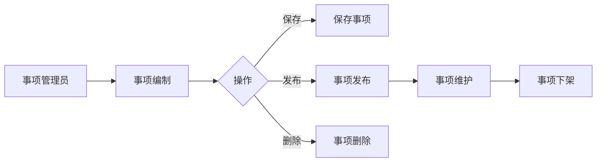

# 政务服务事项管理系统需求总文档

> 基于 BladeX 4.8.0 + Spring Boot 3 + Vue 3 的需求总文档

---

## 文档信息

| 项目名称 | 政务服务事项管理系统 |
|---------|---------------------|
| 文档版本 | V1.0 |
| 编写日期 | 2026-04-02 |
| 文档类型 | 需求总文档 |
| 适用范围 | 一期建设 |

---

## 1. 项目概述

### 1.1 项目背景

**业务现状和痛点**：
- 政务服务事项缺乏统一管理平台，信息分散
- 事项更新不及时，公众获取信息不准确
- 缺乏标准化的事项管理流程

**建设必要性**：
- 提升政务服务标准化、规范化、便利化水平
- 实现事项信息的统一管理和维护
- 提高政务服务效率和透明度

**预期价值**：
- 实现政务服务事项的统一录入、管理和维护
- 支持事项信息的动态更新
- 提供便捷的事项查询和统计功能
- 确保事项信息的准确性和时效性

### 1.2 项目目标

| 目标类型 | 具体目标 |
|---------|---------|
| 业务目标 | 建立统一的政务服务事项管理平台 |
| 效率目标 | 简化事项管理流程，提高管理效率 |
| 规范目标 | 实现事项管理标准化、规范化 |
| 数据目标 | 确保事项数据准确、完整、及时 |

### 1.3 建设范围

#### 一期建设范围

| 功能模块 | 建设内容 | 状态 |
|---------|---------|------|
| 事项信息管理 | 事项的增删改查 | ✅ 实现 |
| 事项发布管理 | 事项发布/下架 | ✅ 实现 |
| 材料附件管理 | 材料文件上传（复用 BladeX 附件表） | ✅ 实现 |

#### 一期暂不实现

| 功能模块 | 说明 | 计划实现时间 |
|---------|------|-------------|
| 审核流程 | 事项审核功能 | 二期 |
| 移动端应用 | 移动办公、事项查询 | 二期 |
| 数据权限 | 部门级数据权限 | 二期 |
| 事项版本对比 | 版本管理和对比 | 二期 |
| 事项办件统计 | 统计分析功能 | 二期 |

---

## 2. 系统架构

### 2.1 技术架构

```
┌─────────────────────────────────────────────────────────────┐
│                        用户层                                │
│  ┌─────────────────────────────────────────────────────────┐│
│  │                        PC 端                              ││
│  │              (Vue 3 + Element Plus + Avue)               ││
│  │                    [管理端功能]                           ││
│  └─────────────────────────────────────────────────────────┘│
└─────────────────────────────────────────────────────────────┘
                              │
                              ▼
┌─────────────────────────────────────────────────────────────┐
│                        服务层                                │
│  ┌─────────────────────────────────────────────────────┐   │
│  │         Spring Boot 3.2.10 + BladeX 4.8.0            │   │
│  │         /blade-affair/affair/* (API 接口)             │   │
│  └─────────────────────────────────────────────────────┘   │
└─────────────────────────────────────────────────────────────┘
                              │
                              ▼
┌─────────────────────────────────────────────────────────────┐
│                        数据层                                │
│  ┌─────────────────────────────────────────────────────┐   │
│  │                  MySQL 8.0 + Redis                   │   │
│  │                  blade_affair                        │   │
│  │                  blade_affair_material               │   │
│  │                  blade_attach (复用)                 │   │
│  └─────────────────────────────────────────────────────┘   │
└─────────────────────────────────────────────────────────────┘
```

### 2.2 技术选型说明

| 端 | 技术栈 | 版本要求 | 说明 |
|---|--------|---------|------|
| PC 前端 | Vue 3 + Element Plus + Avue | 3.5+ | 管理端应用，支持复杂表单和列表 |
| 后端 | Spring Boot 3 + BladeX 4.8.0 | JDK 17+ | 企业级服务框架 |
| 数据库 | MySQL 8.0 + Redis | 8.0+ | 业务数据存储和缓存 |
| 认证授权 | OAuth2 + JWT | BladeX 内置 | 统一认证 |

### 2.3 模块划分

```
政务服务事项管理系统 (/blade-affair/)
└── 事项管理 (affair)     - 事项信息管理、发布/下架
```

---

## 3. 业务全景图

### 3.1 整体业务流程



> **实现范围说明**：一期实现事项信息管理（CRUD）和发布/下架功能，暂不实现审核流程。

### 3.2 业务时序图

```mermaid
sequenceDiagram
    participant 管理员 as 事项管理员
    participant 系统 as 系统

    管理员->>系统：新建事项
    系统->>管理员：返回表单
    管理员->>系统：填写并提交
    系统->>系统：自动生成编码
    系统-->>管理员：保存成功

    管理员->>系统：发布事项
    系统->>系统：更新状态
    系统-->>管理员：发布成功
```

---

## 4. 关键概念定义

### 4.1 核心业务术语

| 术语 | 定义 | 说明 |
|------|------|------|
| 政务服务事项 | 政府部门提供的各类政务服务 | 包括行政许可、行政确认等 |
| 事项类别 | 事项的分类 | 行政许可、行政确认、行政裁决、行政给付、公共服务、其他 |
| 法定时限 | 法律法规规定的办理时限 | 单位：工作日 |
| 承诺时限 | 部门承诺的办理时限 | 单位：工作日，≤法定时限 |
| 实施编码 | 事项的唯一标识编码 | 系统自动生成 |

### 4.2 状态定义

#### 事项状态

| 状态值 | 状态名称 | 说明 |
|--------|---------|------|
| 1 | 正常 | 事项已发布，可正常查询和使用 |
| 2 | 下架 | 事项暂时下架，不可查询 |
| 3 | 删除 | 逻辑删除，不显示 |

### 4.3 编码规则

#### 实施编码生成规则

**格式**：`AFFAIR` + 时间戳 + 6 位序号（共 20 位）

| 组成部分 | 位数 | 说明 | 示例 |
|---------|------|------|------|
| 前缀 | 6 位 | 固定为 AFFAIR | AFFAIR |
| 时间戳 | 14 位 | yyyyMMddHHmmss | 20260402103000 |
| 序号 | 6 位 | 当日序号 | 000001 |

**示例**：
- `AFFAIR20260402103000000001` = 2026 年 4 月 2 日 10:30:00 的第 1 个事项

---

## 5. 文档索引

本需求文档体系包含以下子文档：

| 序号 | 文档名称 | 文档路径 | 主要内容 |
|------|---------|---------|---------|
| 1 | 需求总文档 | [01-需求总文档.md](01-需求总文档.md) | 项目概述、架构、业务全景 |
| 2 | 功能说明子文档 | [02-功能说明子文档.md](02-功能说明子文档.md) | 各功能模块详细说明 |
| 3 | 界面操作子文档 | [03-界面操作子文档.md](03-界面操作子文档.md) | 页面设计、按钮操作、交互规范 |
| 4 | 角色权限子文档 | [04-角色权限子文档.md](04-角色权限子文档.md) | 角色定义、权限矩阵 |
| 5 | 业务流程和规则子文档 | [05-业务流程和规则子文档.md](05-业务流程和规则子文档.md) | 流程图、状态流转、业务规则 |
| 6 | 数据接口子文档 | [06-数据接口子文档.md](06-数据接口子文档.md) | 数据库设计、API 契约 |
| 7 | 公共字典子文档 | [07-公共字典子文档.md](07-公共字典子文档.md) | 字典设计、枚举值定义 |

---

## 6. 附录

### 6.1 名词缩写对照

| 缩写 | 全称 | 中文 |
|------|------|------|
| CRUD | Create, Read, Update, Delete | 增删改查 |
| RBAC | Role-Based Access Control | 基于角色的访问控制 |
| API | Application Programming Interface | 应用程序接口 |
| VO | View Object | 视图对象 |
| Entity | Entity Object | 实体对象 |

### 6.2 参考文档

| 文档名称 | 说明 |
|---------|------|
| 原型设计稿 | PC 端界面原型 |
| 接口设计文档 | 后端 API 详细设计 |
| 数据库设计文档 | 数据表结构详细设计 |

### 6.3 BladeX 相关文档

| 文档名称 | 说明 |
|---------|------|
| [BladeX 整体需求分析文档模板](../../../提示词和需求模板/需求分析模板/01-整体需求分析模板/整体需求分析文档模板.md) | 整体需求分析模板 |
| [模块开发指南](../../../../前后端开发示例/模块开发指南.md) | 模块开发详细指南 |

---

## 7. 确认事项

| 编号 | 问题 | 说明 | 确认结果 | 文档处理 |
|------|------|------|---------|---------|
| 1 | 事项类别方式 | 采用字典方式还是分类方式 | 采用简单字典方式（affair_type 字典） | 已更新至字段说明 |
| 2 | 审核流程 | 是否需要实现审核功能 | 简化版，无审核流程，事项新增后直接生效 | 已移除审核相关内容 |
| 3 | 材料管理 | 材料如何存储 | 子表只存 affair_id 和 attach_id，文件上传到 blade_attach 表 | 已更新至数据库设计 |
| 4 | 承诺时限单位 | 承诺时限使用什么单位 | 仅使用工作日为单位 | 已更新至字段说明 |
| 5 | 移动端 | 是否需要移动端 | 不需要移动端 | 已移除移动端相关内容 |
| 6 | 数据权限 | 是否需要数据权限 | 一期不实现，二期再做 | 已移除数据权限相关内容 |
| 7 | 事项子类 | 是否需要事项子类 | 不需要，只保留事项类别 | 已移除事项子类字段 |
| 8 | 实施部门 | 是否需要实施部门字段 | 不需要 | 已移除实施部门字段 |
| 9 | 所需材料 | 是否必填 | 非必填 | 已更新为可选 |
| 10 | 复杂字段 | 收费/办理相关字段 | 一期不需要（收费标准、收费依据、办理形式、到现场次数、办理结果、结果样本、咨询方式） | 已移除相关字段 |
| 11 | 文件上传格式 | 支持哪些文件格式 | pdf/doc/docx/jpg/png | 已更新至数据库设计 |
| 12 | 实施编码 | 手动录入还是自动生成 | 系统自动生成唯一编码 | 已更新至字段说明 |
