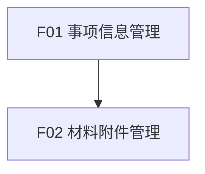

# 政务服务事项管理系统 - 功能说明子文档

> 基于 BladeX 4.8.0 的功能说明模板

---

## 文档信息

| 项目名称 | 政务服务事项管理系统 |
|---------|---------------------|
| 文档版本 | V1.0 |
| 编写日期 | 2026-04-02 |
| 文档类型 | 功能说明子文档 |

---

## 功能模块总览

```
政务服务事项管理系统
├── F01 事项信息管理
└── F02 材料附件管理
```

---

## F01 事项信息管理

### 1. 功能概述

| 属性 | 说明 |
|------|------|
| 功能编号 | F01 |
| 功能名称 | 事项信息管理 |
| 访问端 | PC 端 |
| 功能描述 | 政务服务事项的增删改查、发布/下架 |

### 2. 功能清单

| 功能项 | 功能描述 | 优先级 |
|--------|---------|--------|
| F01-01 | 事项列表查询 | P0 |
| F01-02 | 事项新增 | P0 |
| F01-03 | 事项编辑 | P0 |
| F01-04 | 事项删除 | P0 |
| F01-05 | 事项发布 | P0 |
| F01-06 | 事项下架 | P0 |
| F01-07 | 事项详情查看 | P1 |

### 3. 功能详细说明

#### F01-01 事项列表查询

**功能描述**：分页查询事项列表，支持条件筛选

**输入项（筛选条件）**：

| 字段名 | 字段类型 | 是否必填 | 校验规则 | 说明 |
|--------|---------|---------|---------|------|
| 事项名称 | 文本输入 | 否 | 模糊查询 | 支持部分匹配 |
| 事项类别 | 下拉选择 | 否 | 数据来源：affair_type 字典 | 精确匹配 |
| 事项状态 | 下拉选择 | 否 | 1-正常，2-下架 | 精确匹配 |

**列表字段**：

| 字段名 | 显示方式 | 说明 |
|--------|---------|------|
| 事项名称 | 文本 | 最多 50 字，超出省略 |
| 事项简称 | 文本 | 可选 |
| 事项类别 | 标签 | 字典转换后显示 |
| 法定时限 | 文本 | 单位：工作日 |
| 承诺时限 | 文本 | 单位：工作日 |
| 事项状态 | 标签 | 正常/下架 |
| 创建时间 | 日期 | yyyy-MM-dd HH:mm |
| 发布时间 | 日期 | yyyy-MM-dd HH:mm |

**操作**：
- 编辑（仅创建人可见）
- 删除（仅创建人可见）
- 查看
- 发布（仅状态为下架可见）
- 下架（仅状态为正常可见）

---

#### F01-02 事项新增

**功能描述**：新建政务服务事项

**输入项**：

| 字段名 | 字段类型 | 是否必填 | 校验规则 | 说明 |
|--------|---------|---------|---------|------|
| 事项名称 | 文本输入 | 是 | 长度 1-200 字符 | 事项标准名称 |
| 事项简称 | 文本输入 | 否 | 长度 1-100 字符 | 事项简称 |
| 事项类别 | 下拉选择 | 是 | 数据来源：affair_type 字典 | 6 个固定类别 |
| 法定时限 | 数字输入 | 是 | 非负整数 | 单位：工作日，0 表示即时办结 |
| 承诺时限 | 数字输入 | 是 | 非负整数，≤法定时限 | 单位：工作日 |
| 办理条件 | 富文本编辑 | 是 | - | 支持 HTML 格式 |
| 所需材料 | 动态列表 | 否 | - | 可选添加，关联附件 |
| 备注说明 | 文本域 | 否 | 最多 500 字 | 其他说明信息 |

**处理逻辑**：

1. 校验必填项是否完整
2. 校验承诺时限是否≤法定时限
3. 校验同一机构下事项名称是否重复
4. 生成唯一实施编码
5. 保存事项主表数据
6. 保存材料关联数据（如有）

**输出项**：保存成功提示，返回事项列表

---

#### F01-03 事项编辑

**功能描述**：修改已存在的事项信息

**输入项**：同 F01-02 事项新增

**处理逻辑**：

1. 加载事项详情（含材料子表）
2. 校验必填项是否完整
3. 校验承诺时限是否≤法定时限
4. 校验事项名称是否重复（排除自身）
5. 更新事项主表数据
6. 同步更新材料关联数据
7. 记录操作日志

**输出项**：修改成功提示，返回事项列表

**权限规则**：仅创建人可编辑

---

#### F01-04 事项删除

**功能描述**：删除事项（逻辑删除）

**处理逻辑**：

1. 校验删除权限（仅创建人可删除）
2. 批量删除选中事项
3. 更新 is_deleted=1
4. 记录操作日志

**输出项**：删除成功提示，刷新列表

**权限规则**：仅创建人可删除自己创建的事项

---

#### F01-05 事项发布

**功能描述**：发布事项，使事项生效可查询

**处理逻辑**：

1. 校验发布权限
2. 更新事项状态为正常（status=1）
3. 记录发布时间
4. 记录操作日志

**输出项**：发布成功提示

---

#### F01-06 事项下架

**功能描述**：下架事项，暂时不可查询

**处理逻辑**：

1. 校验下架权限
2. 更新事项状态为下架（status=2）
3. 记录操作日志

**输出项**：下架成功提示

---

#### F01-07 事项详情查看

**功能描述**：查看事项完整信息

**列表字段**：展示事项所有字段，包括：
- 基本信息：事项名称、简称、实施编码、类别
- 时限信息：法定时限、承诺时限
- 办理条件：富文本内容
- 所需材料：材料清单及附件
- 备注说明
- 操作日志：创建时间、发布时间等

---

## F02 材料附件管理

### 1. 功能概述

| 属性 | 说明 |
|------|------|
| 功能编号 | F02 |
| 功能名称 | 材料附件管理 |
| 访问端 | PC 端 |
| 功能描述 | 材料文件的上传、查看、删除（复用 BladeX 附件表） |

### 2. 功能清单

| 功能项 | 功能描述 | 优先级 |
|--------|---------|--------|
| F02-01 | 材料文件上传 | P0 |
| F02-02 | 材料文件查看 | P0 |
| F02-03 | 材料文件删除 | P0 |

### 3. 功能详细说明

#### F02-01 材料文件上传

**功能描述**：上传材料附件到 BladeX 附件表

**输入项**：

| 字段名 | 字段类型 | 是否必填 | 校验规则 | 说明 |
|--------|---------|---------|---------|------|
| 材料名称 | 文本输入 | 是 | 长度 1-200 字符 | 材料标准名称 |
| 材料类型 | 下拉选择 | 是 | 数据来源：material_type 字典 | 原件/复印件/电子文件 |
| 份数要求 | 数字输入 | 是 | 正整数，默认 1 | 材料份数 |
| 材料说明 | 文本输入 | 否 | 最多 500 字 | 材料具体要求 |
| 附件文件 | 文件上传 | 是 | pdf/doc/docx/jpg/png | 单文件≤20M |

**处理逻辑**：

1. 调用 BladeX 附件上传接口
2. 上传成功后获取 attach_id
3. 保存材料关联数据（affair_id + attach_id）

**输出项**：上传成功提示

---

#### F02-02 材料文件查看

**功能描述**：查看已上传的材料文件

**处理逻辑**：

1. 查询 blade_affair_material 表获取 attach_id
2. 关联 blade_attach 表获取文件信息
3. 展示材料列表
4. 支持预览和下载

**输出项**：材料列表及附件信息

---

#### F02-03 材料文件删除

**功能描述**：删除材料文件

**处理逻辑**：

1. 删除 blade_affair_material 表关联记录
2. （可选）级联删除 blade_attach 表记录
3. 记录操作日志

**输出项**：删除成功提示

---

## 功能依赖关系



---

## 补充说明

### 1. 功能优先级定义

| 优先级 | 说明 | 实现时间 |
|--------|------|---------|
| P0 | 核心功能，必须实现 | 一期 |
| P1 | 重要功能，建议实现 | 一期或二期 |
| P2 | 增强功能，可选实现 | 二期 |

### 2. BladeX 框架对接说明

#### 2.1 字典使用

| 字段名 | 字典编码 | 字典项 |
|--------|---------|--------|
| 事项类别 | affair_type | 01-行政许可，02-行政确认，03-行政裁决，04-行政给付，05-公共服务，06-其他 |
| 材料类型 | material_type | 01-原件，02-复印件，03-电子文件，04-其他 |

#### 2.2 权限控制

| 功能项 | 权限码 | 说明 |
|--------|--------|------|
| 新增 | affair_manage_add | 控制新增按钮显示 |
| 修改 | affair_manage_edit | 控制编辑按钮显示 |
| 删除 | affair_manage_delete | 控制删除按钮显示 |
| 查看 | affair_manage_view | 控制查看权限 |
| 发布 | affair_manage_publish | 控制发布按钮显示 |
| 下架 | affair_manage_unpublish | 控制下架按钮显示 |

#### 2.3 附件管理

复用 BladeX 现有的 blade_attach 表，通过 affair_id 关联。
