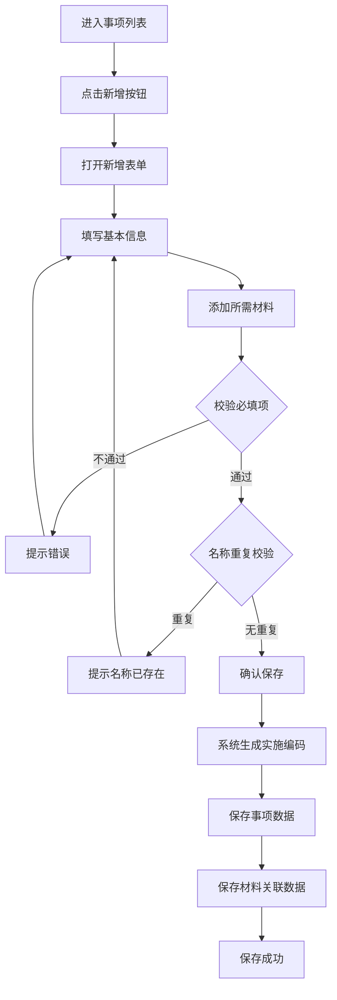
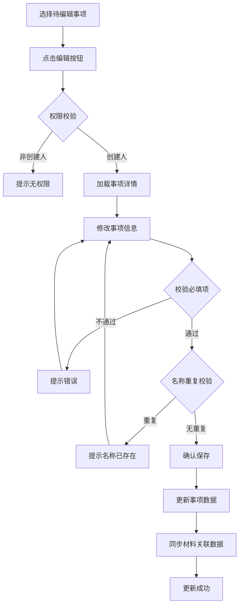
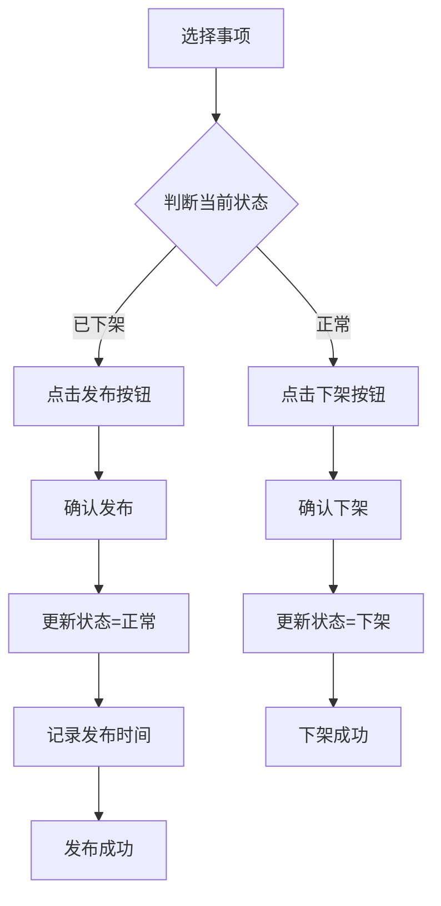
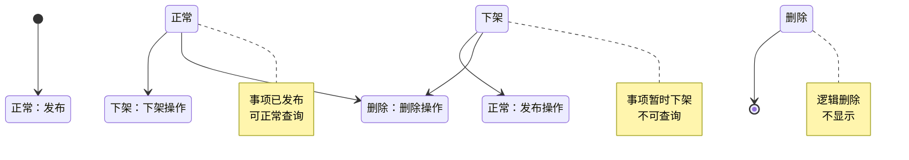

# 政务服务事项管理系统 - 业务流程和规则子文档

> 基于 BladeX 4.8.0 的业务流程和规则模板

---

## 文档信息

| 项目名称 | 政务服务事项管理系统 |
|---------|---------------------|
| 文档版本 | V1.0 |
| 编写日期 | 2026-04-02 |
| 文档类型 | 业务流程和规则子文档 |

---

## 1. 业务流程概述

### 1.1 一期业务流程范围

```
┌─────────────────────────────────────────────────────────────────┐
│              政务服务事项管理系统业务流程（一期）                │
│                                                                 │
│   事项管理员                         系统                        │
│   ┌─────┐                          ┌─────────────────────────┐  │
│   │编制 │                          │                         │  │
│   │事项 │────── 新建 ─────────────▶│  生成编码               │  │
│   └─────┘                          │  保存数据               │  │
│                                    │                         │  │
│   ┌─────┐                          │                         │  │
│   │维护 │────── 编辑 ─────────────▶│  更新数据               │  │
│   │事项 │                          │                         │  │
│   └─────┘                          │                         │  │
│                                    │                         │  │
│   ┌─────┐                          │                         │  │
│   │发布 │────── 发布 ─────────────▶│  更新状态=正常          │  │
│   │事项 │                          │  记录发布时间           │  │
│   └─────┘                          │                         │  │
│                                    │                         │  │
│   ┌─────┐                          │                         │  │
│   │下架 │────── 下架 ─────────────▶│  更新状态=下架          │  │
│   │事项 │                          │                         │  │
│   └─────┘                          │                         │  │
│                                    │                         │  │
│   ┌─────┐                          │                         │  │
│   │删除 │────── 删除 ─────────────▶│  逻辑删除 (is_deleted=1)│  │
│   │事项 │                          │                         │  │
│   └─────┘                          │                         │  │
│                                    └─────────────────────────┘  │
└─────────────────────────────────────────────────────────────────┘
```

### 1.2 一期暂不实现的流程

| 流程环节 | 说明 | 计划实现时间 |
|---------|------|-------------|
| 审核流程 | 事项提交审核 | 二期 |
| 多级审核 | 多级审批流程 | 二期 |
| 移动办理 | 移动端事项办理 | 二期 |

---

## 2. 详细业务流程

### 2.1 事项新建流程



### 2.2 事项编辑流程



### 2.3 事项发布/下架流程



---

## 3. 状态流转规则

### 3.1 事项状态流转图



### 3.2 状态编码定义

| 状态值 | 状态名称 | 说明 | 可执行操作 |
|--------|---------|------|-----------|
| 1 | 正常 | 事项已发布，可正常查询 | 编辑、下架、删除 |
| 2 | 下架 | 事项暂时下架 | 编辑、发布、删除 |
| 3 | 删除 | 逻辑删除 | - |

### 3.3 状态流转规则表

| 当前状态 | 目标状态 | 触发条件 | 操作人 | 备注 |
|---------|---------|---------|--------|------|
| - | 正常 | 发布操作 | 事项管理员 | 新发布或重新发布 |
| 正常 | 下架 | 下架操作 | 事项管理员 | 暂时下架 |
| 下架 | 正常 | 发布操作 | 事项管理员 | 重新发布 |
| 正常/下架 | 删除 | 删除操作 | 创建人 | 逻辑删除 |

---

## 4. 业务规则详解

### 4.1 事项管理规则

#### 规则编号：R-AFF-001 唯一性校验

| 项目 | 内容 |
|------|------|
| 规则名称 | 事项名称唯一性校验 |
| 适用场景 | 新增/编辑事项时 |
| 规则描述 | 同一创建人下，事项名称不能重复 |
| 校验条件 | 查询 `affair_name` 是否已存在（排除自身） |
| 提示信息 | "事项名称已存在，请使用其他名称" |

#### 规则编号：R-AFF-002 时限规则

| 项目 | 内容 |
|------|------|
| 规则名称 | 承诺时限≤法定时限 |
| 适用场景 | 新增/编辑事项时 |
| 规则描述 | 承诺时限必须小于等于法定时限 |
| 校验条件 | `promise_limit <= legal_limit` |
| 提示信息 | "承诺时限不能大于法定时限" |

#### 规则编号：R-AFF-003 编码自动生成

| 项目 | 内容 |
|------|------|
| 规则名称 | 实施编码自动生成 |
| 适用场景 | 新增事项时 |
| 规则描述 | 系统自动生成唯一实施编码 |
| 编码格式 | AFFAIR + yyyyMMddHHmmss + 6 位序号 |
| 示例 | AFFAIR20260402103000000001 |

---

### 4.2 材料管理规则

#### 规则编号：R-MAT-001 材料非必填

| 项目 | 内容 |
|------|------|
| 规则名称 | 所需材料为非必填项 |
| 适用场景 | 新增/编辑事项时 |
| 规则描述 | 所需材料可选添加，不强制要求 |
| 建议 | 建议至少添加一项材料 |

#### 规则编号：R-MAT-002 文件上传限制

| 项目 | 内容 |
|------|------|
| 规则名称 | 文件上传格式和大小限制 |
| 适用场景 | 上传材料附件时 |
| 文件格式 | pdf/doc/docx/jpg/png |
| 单文件大小 | ≤20MB |
| 每项文件数 | 1 个 |
| 提示信息 | "仅支持 pdf/doc/docx/jpg/png 格式，单文件≤20MB" |

---

### 4.3 权限规则

#### 规则编号：R-PER-001 仅创建人可维护

| 项目 | 内容 |
|------|------|
| 规则名称 | 仅创建人可维护 |
| 适用场景 | 编辑/删除操作时 |
| 规则描述 | 仅创建人可编辑/删除自己创建的数据 |
| 例外 | 系统管理员可操作所有数据 |
| 实现方式 | 后端校验 `create_user == currentUserId` |
| 提示信息 | "无权限操作他人数据" |

#### 规则编号：R-PER-002 发布/下架权限

| 项目 | 内容 |
|------|------|
| 规则名称 | 发布/下架权限 |
| 适用场景 | 发布/下架操作时 |
| 权限要求 | 事项管理员或系统管理员 |
| 权限码 | `affair_manage_publish` / `affair_manage_unpublish` |

---

### 4.4 数据规则

#### 规则编号：R-DAT-001 逻辑删除

| 项目 | 内容 |
|------|------|
| 规则名称 | 逻辑删除 |
| 适用场景 | 删除操作时 |
| 规则描述 | 使用 `is_deleted` 字段标记删除，不物理删除 |
| 删除值 | `is_deleted = 1` |
| 未删除值 | `is_deleted = 0` |

#### 规则编号：R-DAT-002 审计字段

| 项目 | 内容 |
|------|------|
| 规则名称 | 审计字段自动填充 |
| 适用场景 | 新增/编辑操作时 |
| 字段列表 | `create_user`, `create_time`, `update_user`, `update_time` |
| 实现方式 | BladeX 自动填充 |

---

## 5. 异常处理规则

### 5.1 业务异常处理

| 异常场景 | 异常代码 | 处理方式 |
|---------|---------|---------|
| 无权限操作 | BIZ-403 | 返回 403，提示"无权限" |
| 数据不存在 | BIZ-404 | 返回 404，提示"数据不存在" |
| 名称重复 | BIZ-500 | 返回错误，提示"名称已存在" |
| 时限校验失败 | BIZ-501 | 返回错误，提示"承诺时限不能大于法定时限" |

### 5.2 数据一致性保障

| 场景 | 保障措施 |
|------|---------|
| 并发操作 | 乐观锁控制（version 字段） |
| 编码生成 | 雪花算法 ID + 唯一约束 |
| 材料上传 | 事务控制，失败回滚 |

---

## 6. 通知规则

### 6.1 操作成功通知

| 触发事件 | 通知方式 | 通知内容 |
|---------|---------|---------|
| 保存成功 | ElMessage.success | "保存成功" |
| 删除成功 | ElMessage.success | "删除成功" |
| 发布成功 | ElMessage.success | "发布成功" |
| 下架成功 | ElMessage.success | "下架成功" |

### 6.2 操作失败通知

| 触发事件 | 通知方式 | 通知内容 |
|---------|---------|---------|
| 保存失败 | ElMessage.error | "保存失败：{原因}" |
| 删除失败 | ElMessage.error | "删除失败：{原因}" |

---

## 7. 业务规则检查清单

### 7.1 新增事项检查

- [ ] 事项名称必填
- [ ] 事项类别必选
- [ ] 法定时限必填且≥0
- [ ] 承诺时限必填且≤法定时限
- [ ] 办理条件必填
- [ ] 事项名称不重复

### 7.2 编辑事项检查

- [ ] 仅创建人可编辑
- [ ] 必填项完整
- [ ] 时限规则正确
- [ ] 事项名称不重复（排除自身）

### 7.3 删除事项检查

- [ ] 仅创建人可删除
- [ ] 确认删除操作
- [ ] 逻辑删除（is_deleted=1）

---

## 8. BladeX 框架对接说明

### 8.1 字典使用

业务状态、类型等枚举值统一通过 BladeX 字典管理：

```sql
-- 事项类别字典
INSERT INTO blade_dict (id, parent_id, code, dict_key, dict_value, sort)
VALUES (100001, 0, 'affair_type', '-1', '事项类别', 1);

INSERT INTO blade_dict (id, parent_id, code, dict_key, dict_value, sort)
VALUES (100002, 100001, 'affair_type', '01', '行政许可', 1),
       (100003, 100001, 'affair_type', '02', '行政确认', 2),
       (100004, 100001, 'affair_type', '03', '行政裁决', 3),
       (100005, 100001, 'affair_type', '04', '行政给付', 4),
       (100006, 100001, 'affair_type', '05', '公共服务', 5),
       (100007, 100001, 'affair_type', '06', '其他', 6);
```

### 8.2 操作日志

BladeX 自动记录操作日志，业务代码中可通过 `@Log` 注解增强日志记录：

```java
@Log("事项新增")
@PostMapping("/save")
public R<Boolean> save(@RequestBody AffairEntity entity) {
    // 业务逻辑
}
```
