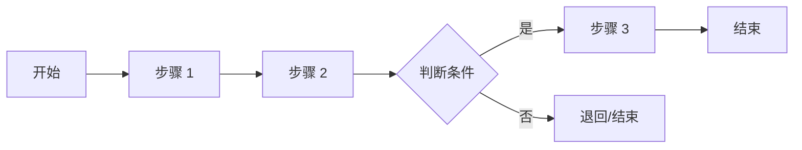
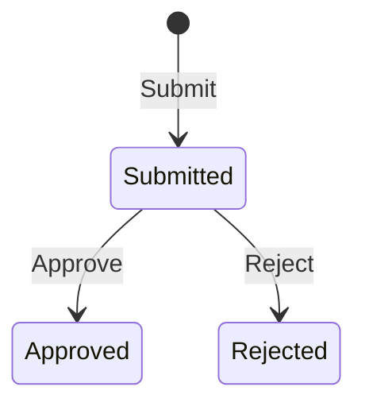

# [模块名称] 整体需求分析文档

> 基于 BladeX 4.8.0 + Spring Boot 3 + Vue 3 的整体需求分析模板

---

## 第 1 章 项目概述

### 1.1 功能背景与目标

本模块为 [XXX 子系统/XXX 管理平台]，旨在实现 [核心业务目标]，覆盖 [用户端/管理端] 的完整业务链，提升 [业务领域] 的效率与规范化水平。

### 1.2 系统架构说明

| 端 | 技术栈 | 说明 |
|---|--------|------|
| PC 前端 | Vue 3 + Vite + Element Plus + Avue 3.7 | 业务管理、数据配置、统计分析 |
| 移动端 | UniApp + uView UI 2.x（可选） | [移动端功能简述] |
| 后端 | Spring Boot 3.2.10 + BladeX 4.8.0 + MyBatis-Plus | 统一 API 服务 |
| 数据库 | MySQL 8.0 + Redis | 业务数据缓存 |
| 认证授权 | OAuth2 + JWT + 多租户 | BladeX 统一认证 |

### 1.3 整体业务流程图



> **实现范围说明**：[说明一期实现范围，暂不实现的功能]

---

## 第 2 章 角色与权限设计

### 2.1 角色列表

| 角色 | 说明 | 对应 BladeX 角色 |
|------|------|-----------------|
| [角色 1] | [角色职责描述] | [角色编码，如：applicant] |
| [角色 2] | [角色职责描述] | [角色编码，如：operator] |
| [角色 3] | [角色职责描述] | [角色编码，如：admin] |
| 系统管理员 | 管理基础配置、用户、角色 | administrator |

### 2.2 功能权限矩阵

| 功能模块 | 角色 1 | 角色 2 | 角色 3 | 系统管理员 |
|---------|--------|--------|--------|----------|
| [功能 1] | 新建/查看 | 审核/查看 | 查看 | 所有 |
| [功能 2] | - | 办理/编辑 | 查看 | 所有 |
| [功能 3] | - | - | 审批 | 所有 |

**权限规则：**
- 同部门可查看，仅创建人可维护
- [特定业务权限规则]
- 数据权限：基于 BladeX 多租户隔离 (`tenant_id`)
- 菜单权限：通过 `blade_menu` 表配置，前端 `@PreAuth` 注解控制

### 2.3 菜单与按钮权限设计

| 菜单名称 | 菜单编号 (code) | 按钮名称 | 按钮编号 (alias) | 权限码 |
|---------|----------------|---------|-----------------|--------|
| [一级菜单] | [module_name] | - | - | `module_name` |
| └─ [子菜单] | [module_name] | 新增 | add | `module_name_add` |
| | | 修改 | edit | `module_name_edit` |
| | | 删除 | delete | `module_name_delete` |
| | | 查看 | view | `module_name_view` |

> **BladeX 规范**：
> - 菜单编号 (`code`) 与 Controller 的 `@PreAuth(menu = "xxx")` 对应
> - 按钮权限码前端通过 `permission.xxx` 控制显示/隐藏

---

## 第 3 章 功能模块详细说明

### 3.1 [功能模块 1 名称]

- **访问端**：PC 端 / 移动端
- **功能描述**：[功能简述]

#### 页面列表

- [页面 1 名称]
- [页面 2 名称]

#### 字段说明

| 字段名 | 字段类型 | 是否必填 | 说明 | 后端字段 |
|--------|---------|---------|------|---------|
| [字段 1] | 文本输入 | 是 | [说明] | [field1] |
| [字段 2] | 下拉选择 | 是 | 数据来源：[xxx 字典] | [field2] |
| [字段 3] | 日期选择 | 否 | [说明] | [field3] |
| [字段 4] | 文件上传 | 否 | word/pdf，最多 N 个 | [field4] |

#### 操作按钮

| 按钮名 | 触发条件 | 操作说明 | 接口 |
|--------|---------|---------|------|
| 提交 | 必填校验通过 | 提交进入下一步 | POST /submit |
| 保存 | - | 暂存草稿 | POST /save |
| 删除 | 勾选记录 | 批量删除 | POST /remove |

#### 业务规则

1. [规则 1：如提交时校验重复]
2. [规则 2：如字段自动填充规则]
3. [规则 3：如状态流转规则]

#### 状态流转（如有）



#### 接口需求

| 接口名称 | 方法 | 路径 | 说明 | BladeX 规范 |
|---------|------|------|------|-----------|
| [功能名称] | POST | `/blade-[模块]/[资源]/submit` | [说明] | `@PreAuth(menu = "xxx")` |
| 列表查询 | GET | `/blade-[模块]/[资源]/list` | [说明] | `Query + Map` 参数 |
| 详情查询 | GET | `/blade-[模块]/[资源]/detail` | [说明] | `R<VO>` 响应 |
| 删除 | POST | `/blade-[模块]/[资源]/remove` | [说明] | 逻辑删除 |

---

### 3.2 [功能模块 2 名称]

> 同上结构...

---

## 第 4 章 数据库设计要点

### 4.1 表设计规范（BladeX）

**所有主表必须包含以下字段**：

| 字段名 | 类型 | 说明 | 默认值 |
|--------|------|------|--------|
| `id` | bigint | 主键（雪花算法） | - |
| `tenant_id` | varchar(12) | 租户 ID | '000000' |
| `create_user` | bigint | 创建人 | NULL |
| `create_dept` | bigint | 创建部门 | NULL |
| `create_time` | datetime | 创建时间 | NULL |
| `update_user` | bigint | 修改人 | NULL |
| `update_time` | datetime | 修改时间 | NULL |
| `status` | int | 状态 | 1 |
| `is_deleted` | int | 是否删除（逻辑删除） | 0 |

### 4.2 主要数据表清单

| 表名 | 说明 | 继承 | 多租户 |
|------|------|------|--------|
| `blade_[模块]_[表 1]` | [表 1 说明] | TenantEntity | 是 |
| `blade_[模块]_[表 2]` | [表 2 说明] | BaseEntity | 是 |
| `blade_[模块]_[表 3]` | [表 3 说明，如附件表] | BaseEntity | 是 |

### 4.3 核心表字段设计

#### `blade_[模块]_[表名]`

| 字段名 | 类型 | 说明 | 字典 |
|--------|------|------|------|
| `id` | bigint | 主键 | - |
| `tenant_id` | varchar(12) | 租户 ID | - |
| [业务字段 1] | varchar(255) | [说明] | 是→[dict_code] |
| [业务字段 2] | int | [说明] | 是→[dict_code] |
| [业务字段 3] | datetime | [说明] | - |
| [业务字段 4] | text | [说明] | - |

### 4.4 字典设计

| 字典编码 (code) | 字典名称 | 字典项 (dict_key → dict_value) |
|----------------|---------|-------------------------------|
| `[dict_code]` | [字典名称] | `1`→[项 1], `2`→[项 2], `3`→[项 3] |

**字典 SQL 示例**：
```sql
-- 字典类型（父级）
INSERT INTO blade_dict (id, parent_id, code, dict_key, dict_value, sort)
VALUES (序列，0, '[dict_code]', '-1', '[字典名称]', 1);

-- 字典值（子级）
INSERT INTO blade_dict (id, parent_id, code, dict_key, dict_value, sort)
VALUES (序列，父级 ID, '[dict_code]', '1', '[项 1]', 1),
       (序列，父级 ID, '[dict_code]', '2', '[项 2]', 2);
```

### 4.5 表间关系

```
[主表] ──1:N── [子表 1]
[主表] ──N:1── [字典表]
[主表] ──N:1── SYS_USER (系统用户)
```

---

## 第 5 章 接口契约汇总

### 5.1 接口规范（BladeX）

**统一响应格式**：
```json
{
  "code": 200,
  "success": true,
  "data": { ... },
  "msg": "操作成功"
}
```

**分页参数**：
```javascript
{
  current: 1,      // 当前页（从 1 开始）
  size: 10,        // 每页条数
  ascs: 'field',   // 正排序（可选）
  descs: 'field'   // 倒排序（可选）
}
```

**查询条件后缀**：
| 后缀 | 说明 | 示例 |
|------|------|------|
| `_equal` | 等于 | `status_equal=1` |
| `_like` | 模糊 | `name_like=张` |
| `_ge` / `_le` | 大于/小于等于 | `age_ge=18` |
| `_datege` / `_datelt` | 日期大于/小于等于 | `createTime_datege=2026-01-01` |

### 5.2 接口清单

#### [功能模块 1]

| 接口名称 | 方法 | 路径 | 请求参数 | 响应结构 | 权限码 |
|---------|------|------|---------|---------|--------|
| 列表查询 | GET | `/blade-[模块]/[资源]/list` | Query + Map | `R<IPage<VO>>` | `[module]_view` |
| 详情 | GET | `/blade-[模块]/[资源]/detail` | id | `R<VO>` | `[module]_view` |
| 新增 | POST | `/blade-[模块]/[资源]/save` | Entity (Body) | `R` | `[module]_add` |
| 修改 | POST | `/blade-[模块]/[资源]/update` | Entity (Body) | `R` | `[module]_edit` |
| 删除 | POST | `/blade-[模块]/[资源]/remove` | ids (String) | `R` | `[module]_delete` |

#### [功能模块 2]

> 同上结构...

### 5.3 前端 API 封装示例

```javascript
// src/api/[模块]/[资源].js
import request from '@/axios';

// 分页查询
export const getList = (current, size, params) => {
  return request({
    url: '/blade-[模块]/[资源]/list',
    method: 'get',
    params: { ...params, current, size },
    cryptoToken: false,
    cryptoData: false,
  });
};

// 详情
export const getDetail = id => {
  return request({
    url: '/blade-[模块]/[资源]/detail',
    method: 'get',
    params: { id },
  });
};

// 新增/修改（共用 submit）
export const add = row => {
  return request({
    url: '/blade-[模块]/[资源]/submit',
    method: 'post',
    data: row,
  });
};

// 删除
export const remove = ids => {
  return request({
    url: '/blade-[模块]/[资源]/remove',
    method: 'post',
    params: { ids },
  });
};
```

---

## 第 6 章 非功能性需求

### 6.1 权限控制要求

- 菜单权限：`@PreAuth(menu = "xxx")` 注解控制
- 按钮权限：前端 `permission.xxx` 控制显示/隐藏
- 数据权限：基于 `tenant_id` 多租户隔离
- 同部门可查看，仅创建人可维护

### 6.2 数据安全要求

- 敏感字段脱敏展示（列表显示）
- 文件上传格式限制（建议 20M）
- 操作日志完整记录（BladeX 自动记录）
- SQL 注入防护（BladeX 自动过滤）

### 6.3 移动端适配要求（如有）

- uni-app 开发，适配主流手机分辨率
- 表单交互符合移动端操作习惯
- 文件上传支持拍照及从相册选择

### 6.4 性能要求

- 列表查询响应时间 < 1s
- 支持大数据量分页（MyBatis-Plus 分页插件）
- 字典数据缓存（Redis）

---

## 第 7 章 确认事项

| 编号 | 问题 | 说明 | 确认结果 | 文档处理 |
|------|------|------|---------|---------|
| 1 | [问题 1] | [问题描述] | [确认结果] | 已更新至 [章节] |
| 2 | [问题 2] | [问题描述] | [确认结果] | 已更新至 [章节] |

---

## 附录：开发检查清单

### 后端开发

- [ ] Entity 继承 `TenantEntity` / `BaseEntity`
- [ ] VO 添加字典转换字段（如 `xxxName`）
- [ ] Mapper 继承 `BaseMapper`
- [ ] Service 继承 `BaseService`
- [ ] ServiceImpl 继承 `BaseServiceImpl`
- [ ] Wrapper 处理字典转换（`DictCache`）
- [ ] Controller 添加 `@PreAuth` 注解
- [ ] Controller 添加 `@TenantDS` 注解
- [ ] 字典枚举添加到 `DictEnum`

### 前端开发

- [ ] API 接口文件创建 (`src/api/[模块]/`)
- [ ] Vue 页面组件创建 (`src/views/[模块]/`)
- [ ] Avue column 配置完整
- [ ] 字典接口 URL 正确 (`/blade-system/dict/dictionary?code=xxx`)
- [ ] 权限码与后端一致
- [ ] 路由配置添加

### 配置 SQL

- [ ] 字典 SQL 脚本
- [ ] 菜单权限 SQL 脚本
- [ ] 执行 SQL 并重启服务（刷新缓存）

---

## 修订记录

| 版本 | 日期 | 修订内容 | 作者 |
|------|------|---------|------|
| 1.0 | 2026-04-02 | 初始版本（基于 BladeX 4.8.0） | - |
