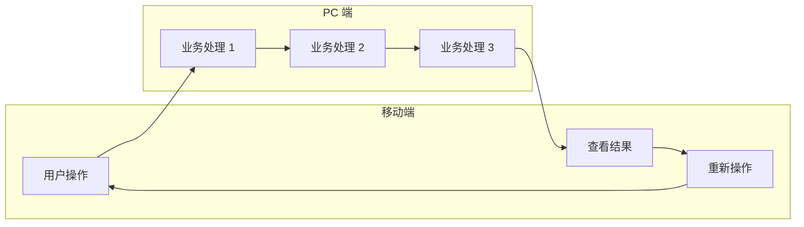

# [系统名称] 需求总文档

> 基于 BladeX 4.8.0 + Spring Boot 3 + Vue 3 的需求总文档模板

---

## 文档信息

| 项目名称 | [填写系统名称] |
|---------|----------------|
| 文档版本 | V1.0 |
| 编写日期 | 2026-04-02 |
| 文档类型 | 需求总文档 |
| 适用范围 | 一期建设 |

---

## 1. 项目概述

### 1.1 项目背景

[描述项目背景，包括：
- 业务现状和痛点
- 建设必要性
- 预期价值]

### 1.2 项目目标

| 目标类型 | 具体目标 |
|---------|---------|
| 业务目标 | [描述业务目标] |
| 效率目标 | [描述效率提升目标] |
| 规范目标 | [描述规范化管理目标] |
| 数据目标 | [描述数据管理和分析目标] |

### 1.3 建设范围

#### 一期建设范围

| 功能模块 | 建设内容 | 状态 |
|---------|---------|------|
| [模块 1] | [功能描述] | ✅ 实现 |
| [模块 2] | [功能描述] | ✅ 实现 |
| [模块 3] | [功能描述] | ✅ 实现 |

#### 一期暂不实现

| 功能模块 | 说明 | 计划实现时间 |
|---------|------|-------------|
| [功能 1] | [功能描述] | 二期 |
| [功能 2] | [功能描述] | 二期 |

---

## 2. 系统架构

### 2.1 技术架构

```
┌─────────────────────────────────────────────────────────────┐
│                        用户层                                │
│  ┌─────────────────┐        ┌─────────────────────────┐    │
│  │    移动端        │        │        PC 端              │    │
│  │  (UniApp Vue3)  │        │  (Vue 3 + Element Plus)  │    │
│  │  [移动端功能]    │        │  [管理端功能]            │    │
│  └─────────────────┘        └─────────────────────────┘    │
└─────────────────────────────────────────────────────────────┘
                              │
                              ▼
┌─────────────────────────────────────────────────────────────┐
│                        服务层                                │
│  ┌─────────────────────────────────────────────────────┐   │
│  │         Spring Boot 3.2.10 + BladeX 4.8.0            │   │
│  │         /blade-[模块]/[资源]/* (API 接口)             │   │
│  └─────────────────────────────────────────────────────┘   │
└─────────────────────────────────────────────────────────────┘
                              │
                              ▼
┌─────────────────────────────────────────────────────────────┐
│                        数据层                                │
│  ┌─────────────────────────────────────────────────────┐   │
│  │                  MySQL 8.0 + Redis                   │   │
│  │                  blade_[模块]_[表名]                  │   │
│  └─────────────────────────────────────────────────────┘   │
└─────────────────────────────────────────────────────────────┘
```

### 2.2 技术选型说明

| 端 | 技术栈 | 版本要求 | 说明 |
|---|--------|---------|------|
| PC 前端 | Vue 3 + Element Plus + Avue | 3.5+ | 管理端应用，支持复杂表单和列表 |
| 移动端 | UniApp + uView UI | Vue 3 | 跨平台移动应用，兼容微信小程序 |
| 后端 | Spring Boot 3 + BladeX 4.8.0 | JDK 17+ | 企业级服务框架 |
| 数据库 | MySQL 8.0 + Redis | 8.0+ | 业务数据存储和缓存 |
| 认证授权 | OAuth2 + JWT + 多租户 | BladeX 内置 | 统一认证和权限控制 |

### 2.3 模块划分

```
[系统名称] (/blade-[模块]/)
├── [模块 1] ([module1])     - [模块 1 功能描述]
├── [模块 2] ([module2])     - [模块 2 功能描述]
├── [模块 3] ([module3])     - [模块 3 功能描述]
└── [统计模块] ([tjfx])      - [统计分析功能]
```

---

## 3. 业务全景图

### 3.1 整体业务流程



> **实现范围说明**：[说明一期实现范围，暂不实现的功能]

### 3.2 业务时序图

```mermaid
sequenceDiagram
    participant 用户 as 终端用户
    participant 操作员 as 业务操作员
    participant 审核员 as 审核人员
    participant 系统 as 系统

    用户->>系统：提交申请
    系统->>操作员：待办任务推送
    操作员->>系统：业务处理

    alt 需要审核
        系统->>审核员：待审核任务推送
        审核员->>系统：审核意见
        系统->>用户：结果通知
    else 无需审核
        系统->>用户：直接反馈结果
    end
```

---

## 4. 关键概念定义

### 4.1 核心业务术语

| 术语 | 定义 | 说明 |
|------|------|------|
| [术语 1] | [定义] | [说明] |
| [术语 2] | [定义] | [说明] |
| [术语 3] | [定义] | [说明] |

### 4.2 状态定义

#### [业务对象] 状态

| 状态值 | 状态名称 | 说明 |
|--------|---------|------|
| [状态 1] | [名称 1] | [说明 1] |
| [状态 2] | [名称 2] | [说明 2] |
| [状态 3] | [名称 3] | [说明 3] |

#### 办理环节

| 环节值 | 环节名称 | 一期实现 |
|--------|---------|---------|
| [环节 1] | [名称 1] | ✅ |
| [环节 2] | [名称 2] | ❌ |

### 4.3 编码规则

#### [编码名称] 生成规则

**格式**：`[格式说明]`（共 X 位）

| 组成部分 | 位数 | 说明 | 示例 |
|---------|------|------|------|
| [部分 1] | X 位 | [说明] | [示例] |
| [部分 2] | X 位 | [说明] | [示例] |

**示例**：
- `[示例 1]` = [说明]
- `[示例 2]` = [说明]

---

## 5. 文档索引

本需求文档体系包含以下子文档：

| 序号 | 文档名称 | 文档路径 | 主要内容 |
|------|---------|---------|---------|
| 1 | 需求总文档 | [01-需求总文档.md](01-需求总文档.md) | 项目概述、架构、业务全景 |
| 2 | 功能说明子文档 | [02-功能说明子文档.md](02-功能说明子文档.md) | 各功能模块详细说明 |
| 3 | 界面操作子文档 | [03-界面操作子文档.md](03-界面操作子文档.md) | 页面设计、按钮操作、交互规范 |
| 4 | 角色权限子文档 | [04-角色权限子文档.md](04-角色权限子文档.md) | 角色定义、权限矩阵 |
| 5 | 业务流程和规则子文档 | [05-业务流程和规则子文档.md](05-业务流程和规则子文档.md) | 流程图、状态流转、业务规则 |
| 6 | 数据接口子文档 | [06-数据接口子文档.md](06-数据接口子文档.md) | 数据库设计、API 契约 |

---

## 6. 附录

### 6.1 名词缩写对照

| 缩写 | 全称 | 中文 |
|------|------|------|
| [缩写 1] | [全称] | [中文] |

### 6.2 参考文档

| 文档名称 | 说明 |
|---------|------|
| 原型设计稿 | 移动端及 PC 端界面原型 |
| 接口设计文档 | 后端 API 详细设计 |
| 数据库设计文档 | 数据表结构详细设计 |

### 6.3 BladeX 相关文档

| 文档名称 | 说明 |
|---------|------|
| [BladeX 整体需求分析文档模板](../01-整体需求分析模板/整体需求分析文档模板.md) | 整体需求分析模板 |
| [模块开发指南](../../../前后端开发示例/08-BladeX 模块开发指南.md) | 模块开发详细指南 |

---

## 7. 确认事项

| 编号 | 问题 | 说明 | 确认结果 | 文档处理 |
|------|------|------|---------|---------|
| 1 | [问题 1] | [问题描述] | [确认结果] | 已更新至 [章节] |
| 2 | [问题 2] | [问题描述] | [确认结果] | 已更新至 [章节] |
