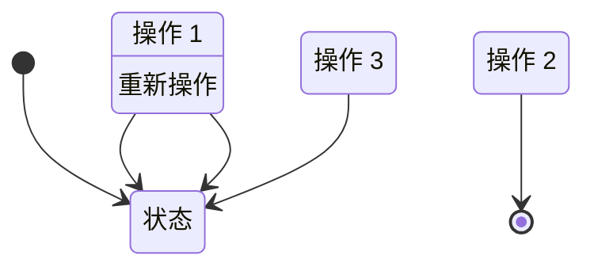
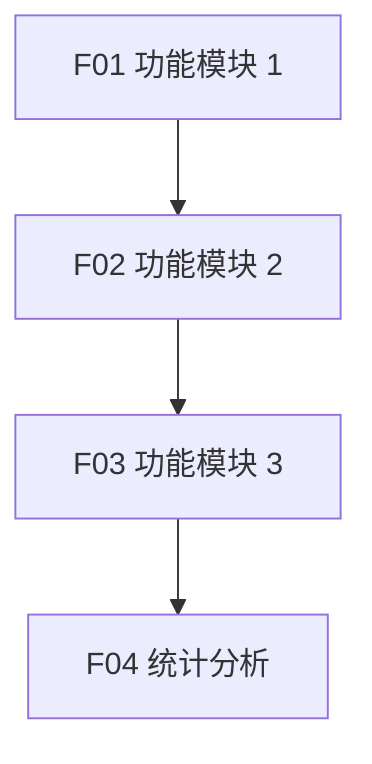

# 功能说明子文档

> 基于 BladeX 4.8.0 的功能说明模板

---

## 文档信息

| 项目名称 | [系统名称] |
|---------|------------|
| 文档版本 | V1.0 |
| 编写日期 | 2026-04-02 |
| 文档类型 | 功能说明子文档 |

---

## 功能模块总览

```
[系统名称]
├── F01 [功能模块 1 名称]
├── F02 [功能模块 2 名称]
├── F03 [功能模块 3 名称]
└── F04 [统计分析模块]
```

---

## F01 [功能模块 1 名称]

### 1. 功能概述

| 属性 | 说明 |
|------|------|
| 功能编号 | F01 |
| 功能名称 | [功能名称] |
| 访问端 | PC 端 / 移动端 |
| 功能描述 | [功能简述] |

### 2. 功能清单

| 功能项 | 功能描述 | 优先级 |
|--------|---------|--------|
| F01-01 | [功能项 1] | P0 |
| F01-02 | [功能项 2] | P0 |
| F01-03 | [功能项 3] | P1 |

### 3. 功能详细说明

#### F01-01 [功能项名称]

**功能描述**：[详细描述功能用途]

**输入项**：

| 字段名 | 字段类型 | 是否必填 | 校验规则 | 说明 |
|--------|---------|---------|---------|------|
| [字段 1] | 文本输入 | 是 | 长度 1-100 字符 | [说明] |
| [字段 2] | 数字输入 | 是 | 正数，最多 2 位小数 | [说明] |
| [字段 3] | 日期选择 | 否 | - | [说明] |
| [字段 4] | 下拉选择 | 是 | 数据来源：[xxx 字典] | [说明] |
| [字段 5] | 文件上传 | 否 | word/pdf，最多 N 个，单文件≤20M | [说明] |

**处理逻辑**：

1. [逻辑步骤 1]
2. [逻辑步骤 2]
3. [逻辑步骤 3]

**输出项**：[处理结果说明]

---

#### F01-02 [功能项名称]

**功能描述**：[详细描述功能用途]

**列表字段**：

| 字段名 | 显示方式 | 说明 |
|--------|---------|------|
| [字段 1] | 文本 | [说明] |
| [字段 2] | 标签 | [说明] |
| [字段 3] | 日期 | yyyy-MM-dd HH:mm |
| [字段 4] | 标签 | [说明] |

**操作**：
- [操作 1]
- [操作 2]

---

### 4. 状态流转



---

## F02 [功能模块 2 名称]

### 1. 功能概述

| 属性 | 说明 |
|------|------|
| 功能编号 | F02 |
| 功能名称 | [功能名称] |
| 访问端 | PC 端 / 移动端 |
| 功能描述 | [功能简述] |

### 2. 功能清单

| 功能项 | 功能描述 | 优先级 |
|--------|---------|--------|
| F02-01 | [功能项 1] | P0 |
| F02-02 | [功能项 2] | P0 |
| F02-03 | [功能项 3] | P1 |

### 3. 功能详细说明

#### F02-01 [功能项名称]

**功能描述**：[详细描述功能用途]

**输入项**：

| 字段名 | 字段类型 | 是否必填 | 校验规则 | 说明 |
|--------|---------|---------|---------|------|
| [字段 1] | 文本输入 | 是 | 长度 1-100 字符 | [说明] |
| [字段 2] | 下拉选择 | 是 | 数据来源：[xxx 字典] | [说明] |

**处理逻辑**：

1. [逻辑步骤 1]
2. [逻辑步骤 2]

**输出项**：[处理结果说明]

---

## 功能依赖关系



---

## 补充说明

### 1. 功能优先级定义

| 优先级 | 说明 | 实现时间 |
|--------|------|---------|
| P0 | 核心功能，必须实现 | 一期 |
| P1 | 重要功能，建议实现 | 一期或二期 |
| P2 | 增强功能，可选实现 | 二期 |

### 2. 功能扩展建议

| 功能项 | 扩展建议 | 优先级 |
|--------|---------|--------|
| [功能 1] | [扩展建议] | P2 |
| [功能 2] | [扩展建议] | P1 |

### 3. BladeX 框架对接说明

#### 3.1 字典使用

| 字段名 | 字典编码 | 字典项 |
|--------|---------|--------|
| [状态字段] | [dict_code] | `1`→正常，`2`→禁用 |

#### 3.2 权限控制

| 功能项 | 权限码 | 说明 |
|--------|--------|------|
| 新增 | `[module]_add` | 控制新增按钮显示 |
| 修改 | `[module]_edit` | 控制编辑按钮显示 |
| 删除 | `[module]_delete` | 控制删除按钮显示 |
| 查看 | `[module]_view` | 控制查看权限 |

#### 3.3 多租户隔离

所有业务数据基于 `tenant_id` 字段实现多租户隔离，新增数据时自动填充当前租户 ID。
