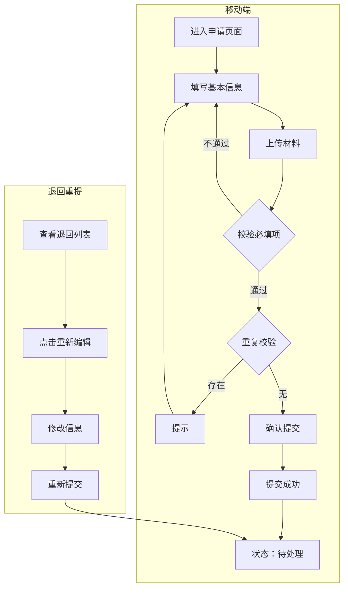
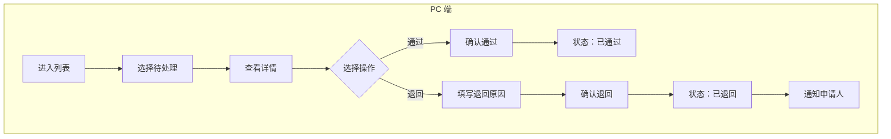
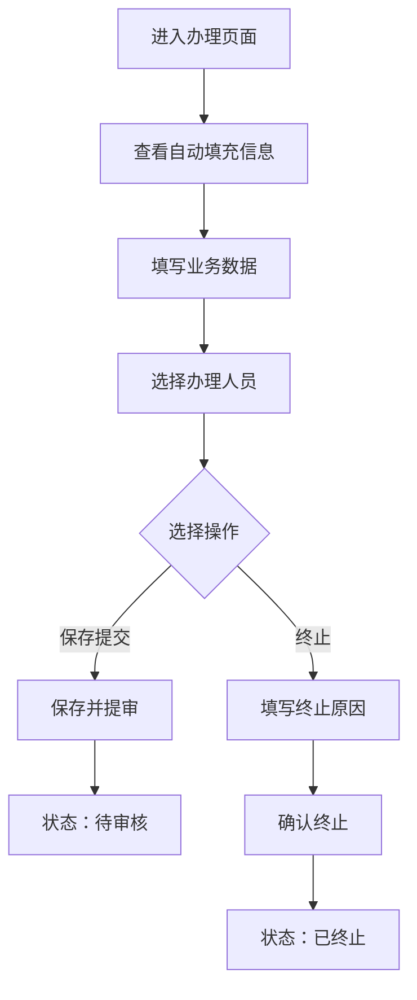
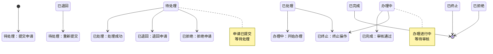

# 业务流程和规则子文档

> 基于 BladeX 4.8.0 的业务流程和规则模板

---

## 文档信息

| 项目名称 | [系统名称] |
|---------|------------|
| 文档版本 | V1.0 |
| 编写日期 | 2026-04-02 |
| 文档类型 | 业务流程和规则子文档 |

---

## 1. 业务流程概述

### 1.1 一期业务流程范围

```
┌─────────────────────────────────────────────────────────────────┐
│                      [系统名称] 业务流程（一期）                │
│                                                                 │
│   移动端                        PC 端                           │
│   ┌─────┐                     ┌─────────────────────────────┐  │
│   │申请 │                     │                             │  │
│   └──┬──┘                     │  ┌───────┐    ┌───────┐   │  │
│      │                        │  │业务处理│───▶│审核   │   │  │
│      ▼                        │  └───┬───┘    └───┬───┘   │  │
│   ┌─────┐                     │      │            │       │  │
│   │提交 │────────────────────▶│      │            ▼       │  │
│   └─────┘                     │      │      ┌───────┐    │  │
│      │                        │      │      │办结   │    │  │
│      │                        │      │      └───┬───┘    │  │
│      │                        │      │          │        │  │
│      │                        │      │    ┌─────┴─────┐  │  │
│      │                        │      │    │           │  │  │
│      │                        │      │  完成      退回  │  │
│      │                        │      │    │           │  │  │
│      │                        │      │    ▼           │  │  │
│      │                        │      │  已办结        │  │  │
│      │                        │      │                │  │  │
│      │◀───────────────────────│──────┼────────────────┘  │  │
│      │                        │      │                    │  │
│      ▼                        │      ▼                    │  │
│   ┌─────┐                     │  终止                    │  │
│   │退回 │                     │                            │  │
│   │修改 │                     │                            │  │
│   └──┬──┘                     │                            │  │
│      │                        └─────────────────────────────┘  │
│      ▼                                                          │
│   ┌─────┐                                                       │
│   │重新 │                                                       │
│   │提交 │──────────────────────────────────────────────────────▶│
│   └─────┘                                                       │
│                                                                 │
└─────────────────────────────────────────────────────────────────┘
```

### 1.2 一期暂不实现的流程

| 流程环节 | 说明 | 计划实现时间 |
|---------|------|-------------|
| [环节 1] | [说明] | 二期 |
| [环节 2] | [说明] | 二期 |

---

## 2. 详细业务流程

### 2.1 [业务流程 1 名称]



### 2.2 [业务流程 2 名称]



### 2.3 [业务流程 3 名称]



---

## 3. 状态流转规则

### 3.1 [业务对象] 状态流转图



### 3.2 状态编码定义

| 状态编码 | 状态名称 | 说明 | 可执行操作 |
|---------|---------|------|-----------|
| [状态 1] | [名称 1] | [说明] | [操作列表] |
| [状态 2] | [名称 2] | [说明] | [操作列表] |
| [状态 3] | [名称 3] | [说明] | [操作列表] |
| [状态 4] | [名称 4] | [说明] | [操作列表] |

### 3.3 办理环节定义

| 环节编码 | 环节名称 | 一期实现 | 说明 |
|---------|---------|---------|------|
| [环节 1] | [名称 1] | ✅ | [说明] |
| [环节 2] | [名称 2] | ❌ | [说明] |

### 3.4 状态流转规则表

| 当前状态 | 目标状态 | 触发条件 | 操作人 | 备注 |
|---------|---------|---------|--------|------|
| - | [状态 1] | [触发条件] | [角色] | [备注] |
| [状态 1] | [状态 2] | [触发条件] | [角色] | [备注] |
| [状态 2] | [状态 3] | [触发条件] | [角色] | [备注] |

---

## 4. 业务规则详解

### 4.1 申请规则

#### 规则编号：R-APP-001 [规则名称]

| 项目 | 内容 |
|------|------|
| 规则名称 | [规则名称] |
| 适用场景 | [适用场景] |
| 规则描述 | [规则描述] |
| 校验条件 | [校验逻辑] |
| 提示信息 | "[提示文案]" |

#### 规则编号：R-APP-002 [规则名称]

| 项目 | 内容 |
|------|------|
| 规则名称 | [规则名称] |
| 适用场景 | [适用场景] |
| 规则描述 | [规则描述] |
| 实现方式 | [实现方式] |

#### 规则编号：R-APP-003 文件上传限制

| 项目 | 内容 |
|------|------|
| 规则名称 | 文件上传限制 |
| 适用场景 | 上传材料时 |
| 规则描述 | 限制文件格式和大小 |
| 文件格式 | word/pdf |
| 单文件大小 | ≤20MB |
| 每项文件数 | ≤N 个 |

---

### 4.2 处理规则

#### 规则编号：R-HAN-001 [规则名称]

| 项目 | 内容 |
|------|------|
| 规则名称 | [规则名称] |
| 适用场景 | [适用场景] |
| 规则描述 | [规则描述] |
| 权限校验 | [校验逻辑] |

#### 规则编号：R-HAN-002 [规则名称]

| 项目 | 内容 |
|------|------|
| 规则名称 | [规则名称] |
| 适用场景 | [适用场景] |
| 规则描述 | [规则描述] |
| 必填项 | [必填内容] |

---

### 4.3 审核规则

#### 规则编号：R-AUD-001 [规则名称]

| 项目 | 内容 |
|------|------|
| 规则名称 | [规则名称] |
| 适用场景 | [适用场景] |
| 规则描述 | [规则描述] |
| 审核级别 | [级数] |
| 通过条件 | [条件] |

#### 规则编号：R-AUD-002 审核意见必填

| 项目 | 内容 |
|------|------|
| 规则名称 | 审核意见必填 |
| 适用场景 | 审核通过或退回时 |
| 规则描述 | 每级审核均需填写审核意见 |
| 实现方式 | 弹窗填写意见 |

---

### 4.4 数据规则

#### 规则编号：R-DAT-001 同部门可查看

| 项目 | 内容 |
|------|------|
| 规则名称 | 同部门可查看 |
| 适用场景 | 列表查询时 |
| 规则描述 | 同一部门的人员可查看本部门的所有数据 |
| 实现方式 | 查询条件：`create_dept = 当前用户部门 ID` |

#### 规则编号：R-DAT-002 仅创建人可维护

| 项目 | 内容 |
|------|------|
| 规则名称 | 仅创建人可维护 |
| 适用场景 | 修改/删除操作时 |
| 规则描述 | 仅创建人可修改/删除自己创建的数据 |
| 例外 | 系统管理员可操作所有数据 |

#### 规则编号：R-DAT-003 敏感数据脱敏

| 项目 | 内容 |
|------|------|
| 规则名称 | 敏感数据脱敏 |
| 适用场景 | 列表展示时 |
| 规则描述 | 身份证号、联系电话等敏感字段需脱敏展示 |
| 脱敏规则 | 身份证：前 3 后 4，中间*；手机号：前 3 后 4，中间* |

---

## 5. 异常处理规则

### 5.1 业务异常处理

| 异常场景 | 异常代码 | 处理方式 |
|---------|---------|---------|
| [场景 1] | BIZ-001 | [处理方式] |
| [场景 2] | BIZ-002 | [处理方式] |
| [场景 3] | BIZ-003 | [处理方式] |

### 5.2 数据一致性保障

| 场景 | 保障措施 |
|------|---------|
| 并发操作 | 乐观锁控制 |
| 编号生成 | 数据库序列 + 唯一约束 |
| 流程流转 | 状态机控制 |
| 文件上传 | 事务控制，失败回滚 |

---

## 6. 通知规则

### 6.1 站内通知

| 触发事件 | 通知对象 | 通知内容 |
|---------|---------|---------|
| [事件 1] | [对象] | "[通知内容]" |
| [事件 2] | [对象] | "[通知内容]" |

### 6.2 待办任务

| 任务类型 | 任务名称 | 任务对象 |
|---------|---------|---------|
| 待处理 | [任务名称] | [对象] |
| 待审核 | [任务名称] | [对象] |

---

## 7. 业务规则检查清单

### 7.1 [环节 1] 检查

- [ ] [检查项 1]
- [ ] [检查项 2]
- [ ] [检查项 3]

### 7.2 [环节 2] 检查

- [ ] [检查项 1]
- [ ] [检查项 2]
- [ ] [检查项 3]

---

## 8. 补充业务场景

### 8.1 边界场景处理

| 场景 | 处理方式 |
|------|---------|
| [场景 1] | [处理方式] |
| [场景 2] | [处理方式] |

### 8.2 特殊场景处理

| 场景 | 处理方式 |
|------|---------|
| [场景 1] | [处理方式] |
| [场景 2] | [处理方式] |

---

## 9. BladeX 框架对接说明

### 9.1 工作流配置

如需要复杂工作流，可使用 BladeX 集成的 PowerJob 或自建工作流引擎。

### 9.2 字典使用

业务状态、类型等枚举值统一通过 BladeX 字典管理：

```sql
-- 字典类型
INSERT INTO blade_dict (id, parent_id, code, dict_key, dict_value, sort)
VALUES (序列，0, '[dict_code]', '-1', '[字典名称]', 1);

-- 字典值
INSERT INTO blade_dict (id, parent_id, code, dict_key, dict_value, sort)
VALUES (序列，父级 ID, '[dict_code]', '1', '[项 1]', 1);
```

### 9.3 操作日志

BladeX 自动记录操作日志，业务代码中可通过 `@Log` 注解增强日志记录：

```java
@Log("业务操作描述")
@PostMapping("/save")
public R<Boolean> save(@RequestBody Entity entity) {
    // 业务逻辑
}
```
